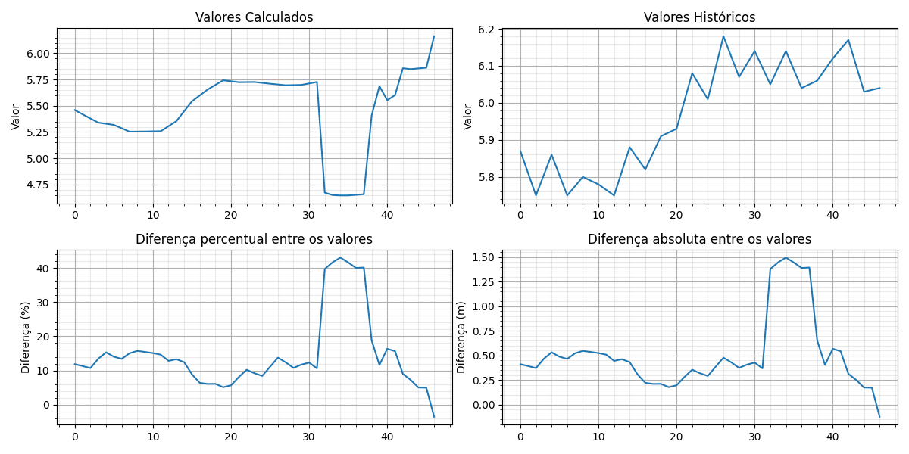
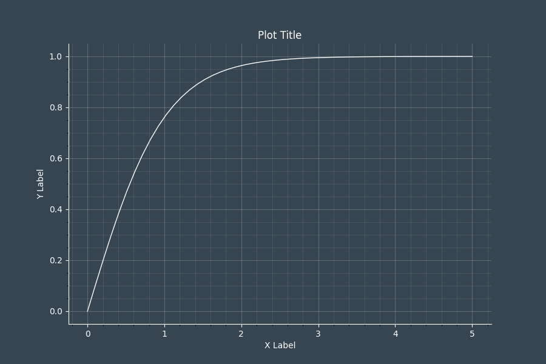
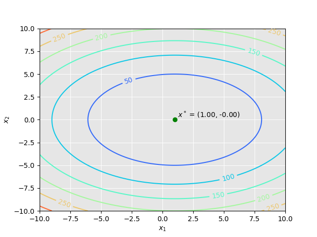
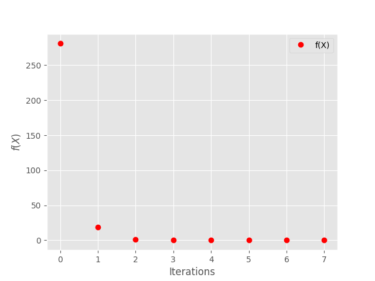
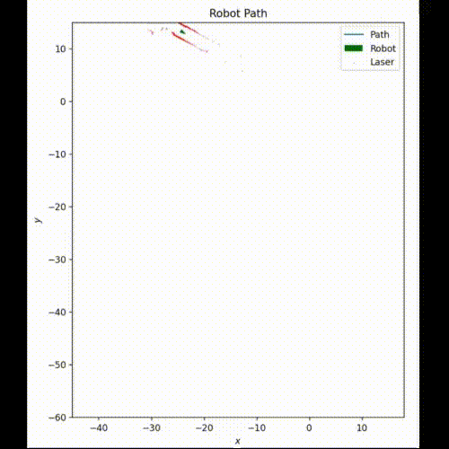
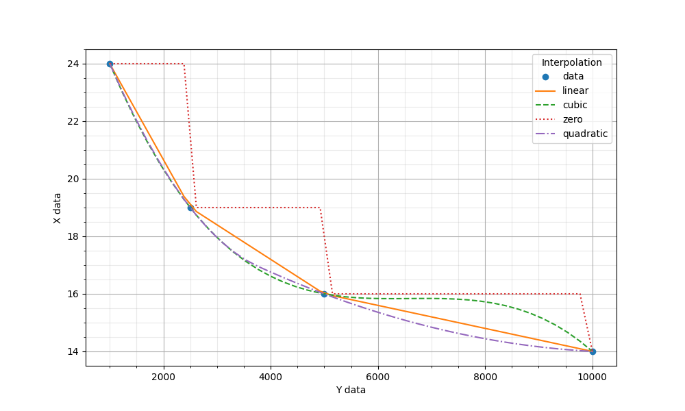
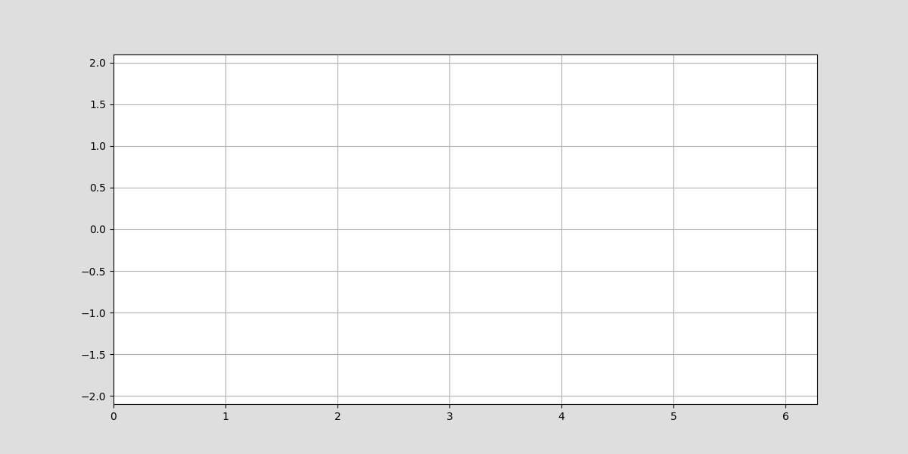

# Python Plots
Repository containing scripts for plotting data in different ways.
I mainly created this project to save the scripts for whenever I need them later. Feel free to use it as you want.

## Plot Styles From Each Script

### Compare Values

### Elegant Plot

### Gradient Method

### Odometry Plotter

### Parametric Curve Animation

### Polynomial Interpolations

### RAM CPU Usage

### Sine Animation

### Wind Data

