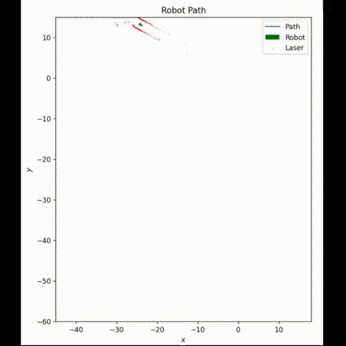

# Odometry Plotter
This is a script for a [ROS](http://wiki.ros.org/Documentation) node that plots odometry data
that is being published to `/odom` topic. It also plots a point cloud from a planar laser
using `/scan` topic data.
## Result

