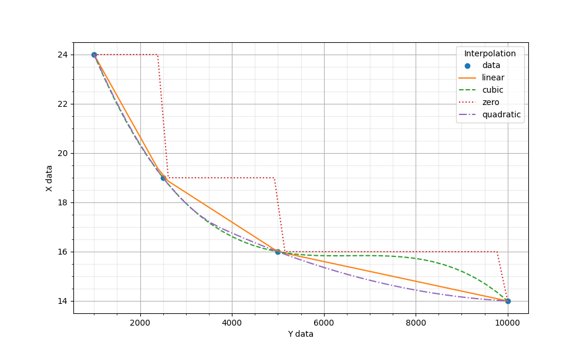

# Polynomial Interpolations
Receives a set of `(x,y)` data and creates four interpolations:
- linear
- cubic
- zero
- quadratic

## Result

# Interpolate Data
Creates a cubic spline interpolation from the points clicked
in the screen. Since it is made a cubic interpolation, it needs
at least 4 points.

## Result

