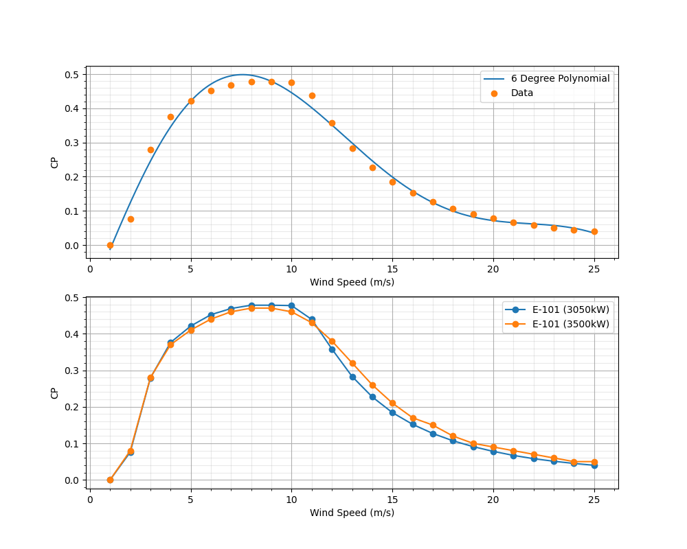

# Wind Data
Compare the data from two different wind turbines, wind speed and CP (power coefficient).
It also creates a 6 degree interpolation and compare with the actual data of one of the turbines and prints
the polynomial coefficients.

## Result

